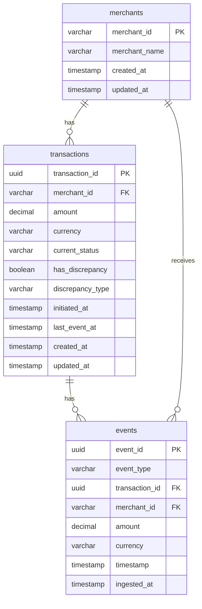

# Setu Solutions Engineer — Assignment Deep-Dive & Architecture Proposal

## 1. Summary of All Requirements

Build and **deploy** a lightweight backend service for a partner integrating with Setu. The service ingests payment lifecycle events from multiple systems, maintains transaction + reconciliation state, exposes REST APIs for operations teams, and surfaces discrepancies between payment and settlement states.

| Constraint | Detail |
|---|---|
| **Language** | Python |
| **Framework** | Flask **or** FastAPI |
| **Database** | Any SQL database |
| **Data** | `sample_events.json` — ~10,000 events, 5 merchants, ~2 weeks of data (Jan 8–21 2026) |
| **Deployment** | Must be deployed (the word "deploy" is explicitly used) |

---

## 2. Functional Requirements

### API 1 — `POST /events` (Ingest Events)
- Accept lifecycle events: `payment_initiated`, `payment_processed`, `payment_failed`, `settled`
- Each event carries: `event_id`, `event_type`, `transaction_id`, `merchant_id`, `merchant_name`, `amount`, `currency`, `timestamp`
- **Idempotent**: duplicate `event_id` submissions must not corrupt state
- **Event history must be preserved** — this is an append-only event log, not just a latest-state table

### API 2 — `GET /transactions` (List Transactions)
- Filter by: `merchant_id`, `status`, date range (`start_date`, `end_date`)
- Support pagination (offset/limit or cursor-based)
- Support sorting (by date, amount, etc.)

### API 3 — `GET /transactions/{transaction_id}` (Transaction Detail)
- Return: transaction details, current status, merchant info, full event history (ordered chronologically)

### API 4 — `GET /reconciliation/summary` (Summary Report)
- Aggregate by dimensions: merchant, date, status
- Flexible grouping (the assignment says "grouped by dimensions *such as*" — it's open-ended)
- Format is designer's choice, but must be **well-documented**

### API 5 — `GET /reconciliation/discrepancies` (Discrepancy Report)
- Detect and return:
  1. **Processed but never settled** — `payment_processed` exists, no `settled` event
  2. **Settled after failure** — `settled` event exists for a transaction that also has `payment_failed`
  3. **Duplicate conflicting events** — e.g., duplicate `settled` events with different `event_id`s

---

## 3. Non-Functional Requirements

| Category | Expectation |
|---|---|
| **Idempotency** | Core requirement — explicitly called out |
| **Deployment** | Service must be deployable/deployed (not just local) |
| **Documentation** | API format must be well-documented (Swagger/OpenAPI implied by FastAPI choice) |
| **Production-mindedness** | The phrase "production-minded, deployable, and efficient" is used verbatim |
| **Schema design** | "Easy to reason about and efficient to query" |
| **Efficiency** | Queries over ~10K events and growing dataset must be fast (indexing, query optimization) |
| **Data integrity** | Financial data — amounts must not have floating-point drift |

---

## 4. Edge Cases (Identified from Sample Data Analysis)

### 4.1 Duplicate Events (Same `event_id`)
The sample data contains **exact duplicate rows** — same `event_id`, same everything.
Example spotted at lines 620–639: `event_id: ef4f7497-6469-4734-9760-ce3bc2e9d66a` appears twice.
→ Must be silently deduplicated via `event_id` uniqueness.

### 4.2 Duplicate Settlements (Different `event_id`, same `transaction_id` + `event_type`)
Example: `transaction_id: 02d878de-f807-4bf1-9b16-7098be6e54fe` has **two** `settled` events:
- `event_id: af0e9f56...` at `22:06:10`
- `event_id: beb8993c...` at `22:10:10`

→ Both are valid events (different `event_id`s) but represent a **discrepancy**: duplicate settlement is an anomaly.

### 4.3 Settlement on Failed Payment
A transaction that has `payment_failed` but also later gets a `settled` event.
→ This is a core discrepancy scenario. The status derivation logic must track this.

### 4.4 Orphan States
- Transactions stuck at `payment_initiated` forever (no subsequent event)
- Transactions stuck at `payment_processed` (never settled — could be "pending" or "discrepancy" depending on time threshold)

### 4.5 Event Ordering
- Events may arrive out of order (timestamp doesn't guarantee ingestion order)
- Status must be derived from the **event with the latest timestamp**, not insertion order

### 4.6 Amount Consistency
- All events for a single `transaction_id` carry the same `amount` — but what if they don't? → Should validate or at least flag amount mismatches as discrepancies

### 4.7 Merchant Data Denormalization
- `merchant_name` is embedded in every event, but a `merchant_id` could theoretically have different names across events
- Need to decide: normalize merchants or keep denormalized with latest-wins

### 4.8 Currency
- All sample data is `INR`, but schema should support multi-currency
- Aggregation queries must not sum across different currencies

### 4.9 Truncated JSON
- The sample JSON file appears truncated at the very end (line 14443 cuts off mid-event)
- The data loader must handle malformed trailing entries gracefully

---

## 5. Hidden Expectations from Evaluation Criteria

> [!IMPORTANT]
> These are the things that separate a "pass" from a "strong hire" signal. Setu is a fintech company — they care deeply about the things below.

### 5.1 Event Sourcing Awareness
The entire assignment is modeled around **event sourcing**. They want to see that you understand:
- Events are immutable, append-only
- State (transaction status) is **derived** from events, not mutated in place
- The event log is the source of truth

### 5.2 State Machine Thinking
The valid state transitions are:
```
payment_initiated → payment_processed → settled  (happy path)
payment_initiated → payment_failed                (failure path)
```
Anything outside this is a discrepancy. They want you to model and enforce this.

### 5.3 API Design Quality
- Consistent response shapes (envelope pattern: `{ data, meta, errors }`)
- Proper HTTP status codes (201 for created, 200 for GET, 409 for conflict, 422 for validation)
- Pagination metadata (total count, page, has_next)
- Filtering via query parameters, not request body

### 5.4 Code Organization
- Clean separation: routes → services → repositories → models
- Not a single monolithic file
- Type hints, Pydantic models for request/response schemas

### 5.5 Database Migrations
- Using Alembic or equivalent, not raw `CREATE TABLE` scripts
- Shows awareness of schema evolution

### 5.6 Seed/Load Script
- A script to load `sample_events.json` into the database
- Demonstrates the service works end-to-end with real data

### 5.7 Docker / Deployment
- `Dockerfile` + `docker-compose.yml`
- Actually deployed somewhere (Render, Railway, Fly.io)
- Deployment URL in README

### 5.8 Testing
- At least basic API tests (pytest)
- Test idempotency, test discrepancy detection

### 5.9 README Quality
- Setup instructions, architecture diagram, API documentation
- This is a **Solutions Engineer** role — communication is being evaluated

---

## 6. Risks and Implementation Challenges

| Risk | Mitigation |
|---|---|
| **Floating-point amounts** | Store as `DECIMAL(12,2)` or integer cents, never `FLOAT` |
| **Status derivation at query time vs. materialized** | Materialized `current_status` column on transactions table, updated on event ingest. Avoids expensive joins on every GET |
| **Discrepancy detection performance** | Pre-compute discrepancy flags on ingest, or use efficient SQL window functions |
| **Truncated sample JSON** | Parse with error handling; skip malformed trailing entries |
| **Out-of-order events** | Derive status from max-timestamp event, not last-inserted event |
| **Pagination on large datasets** | Use keyset (cursor-based) pagination for efficiency, or offset with proper indexing |
| **Deployment stability** | Use free-tier providers (Render, Railway); include health check endpoint |
| **Time zones** | All timestamps are UTC+00:00 in sample; store as UTC, return as UTC with ISO 8601 format |

---

## 7. Proposed Production-Ready Architecture

### 7.1 Tech Stack

| Layer | Choice | Rationale |
|---|---|---|
| **Framework** | FastAPI | Auto OpenAPI docs, async support, Pydantic validation, type safety |
| **Database** | PostgreSQL | Best-in-class SQL, `DECIMAL` type, JSON support, free on Render/Supabase |
| **ORM** | SQLAlchemy 2.0 | Industry standard, async support with `asyncpg` |
| **Migrations** | Alembic | Paired with SQLAlchemy, versioned schema changes |
| **Validation** | Pydantic v2 | Request/response schemas with auto-docs |
| **Deployment** | Render (or Railway) | Free tier, PostgreSQL included, auto-deploy from Git |
| **Containerization** | Docker + docker-compose | Local dev parity, easy deployment |

### 7.2 Database Schema



> [!TIP]
> **Key design decisions:**
> - `transactions.current_status` is a **materialized view** of the latest event — updated on each event ingest. This makes `GET /transactions` fast without joins.
> - `transactions.has_discrepancy` and `discrepancy_type` are **pre-computed flags** — updated on ingest when an anomalous state transition is detected.
> - `events` table is append-only. The `event_id` column has a `UNIQUE` constraint for idempotency.
> - `amount` is stored as `DECIMAL(12,2)`, never `FLOAT`.

### 7.3 Project Structure

```
Backend/
├── app/
│   ├── __init__.py
│   ├── main.py                 # FastAPI app creation, startup events
│   ├── config.py               # Settings (env vars, DB URL)
│   ├── database.py             # SQLAlchemy engine, session factory
│   ├── models/
│   │   ├── __init__.py
│   │   ├── merchant.py
│   │   ├── transaction.py
│   │   └── event.py
│   ├── schemas/
│   │   ├── __init__.py
│   │   ├── event.py            # Pydantic request/response models
│   │   ├── transaction.py
│   │   └── reconciliation.py
│   ├── routers/
│   │   ├── __init__.py
│   │   ├── events.py           # POST /events
│   │   ├── transactions.py     # GET /transactions, GET /transactions/{id}
│   │   └── reconciliation.py   # GET /reconciliation/summary, /discrepancies
│   ├── services/
│   │   ├── __init__.py
│   │   ├── event_service.py    # Business logic for event ingestion
│   │   ├── transaction_service.py
│   │   └── reconciliation_service.py
│   └── utils/
│       ├── __init__.py
│       ├── state_machine.py    # Valid state transitions
│       └── pagination.py       # Pagination helpers
├── alembic/                    # Database migrations
│   ├── versions/
│   └── env.py
├── scripts/
│   └── seed.py                 # Load sample_events.json into DB
├── tests/
│   ├── test_events.py
│   ├── test_transactions.py
│   └── test_reconciliation.py
├── sample_events.json
├── alembic.ini
├── requirements.txt
├── Dockerfile
├── docker-compose.yml
├── .env.example
└── README.md
```

### 7.4 State Machine (Discrepancy Detection Logic)

```python
# Valid transitions
VALID_TRANSITIONS = {
    None: {"payment_initiated"},
    "payment_initiated": {"payment_processed", "payment_failed"},
    "payment_processed": {"settled"},
    "payment_failed": set(),   # terminal state
    "settled": set(),           # terminal state
}

# Discrepancy types to detect:
# 1. "settled_after_failure"  → settled event on a failed transaction
# 2. "never_settled"          → processed but no settled (time-based or on-demand)
# 3. "duplicate_terminal"     → multiple settled or multiple failed events
# 4. "invalid_transition"     → any transition not in VALID_TRANSITIONS
```

### 7.5 API Response Design

```json
// Success envelope
{
  "success": true,
  "data": { ... },
  "meta": {
    "page": 1,
    "per_page": 20,
    "total": 1543,
    "has_next": true
  }
}

// Error envelope
{
  "success": false,
  "error": {
    "code": "DUPLICATE_EVENT",
    "message": "Event with this ID already exists"
  }
}
```

### 7.6 Indexing Strategy

| Index | Table | Columns | Purpose |
|---|---|---|---|
| PK | events | `event_id` | Idempotency + lookup |
| IX_1 | events | `transaction_id, timestamp` | Event history retrieval (ordered) |
| PK | transactions | `transaction_id` | Direct lookup |
| IX_2 | transactions | `merchant_id, current_status` | Filtered listing |
| IX_3 | transactions | `last_event_at` | Date range filtering + sorting |
| IX_4 | transactions | `has_discrepancy` | Discrepancy report |

### 7.7 Deployment Plan

```
GitHub repo → Render.com (free tier)
├── Web Service: FastAPI (uvicorn)
├── PostgreSQL: Render managed DB
└── Seed: One-time `python scripts/seed.py` via Render shell
```

---

## User Review Required

> [!IMPORTANT]
> **Decisions that need your input before I write code:**

1. **Framework**: FastAPI (my recommendation) vs Flask — FastAPI gives us auto Swagger docs which is a big win for a Solutions Engineer role. Agreed?

2. **Database**: PostgreSQL on Render (free tier) vs SQLite for simplicity. PostgreSQL is more "production-minded" but requires deployment. SQLite is zero-config but less impressive. Recommendation: **PostgreSQL**.

3. **Deployment target**: Render.com (free tier, includes Postgres) vs Railway vs Fly.io. Recommendation: **Render**.

4. **Pagination style**: Offset-based (simpler, `?page=1&per_page=20`) vs Cursor-based (more scalable). Recommendation: **Offset-based** for this scale.

5. **Async vs Sync**: Full async (SQLAlchemy + asyncpg) or sync (simpler, fewer gotchas). Recommendation: **Sync** — more reliable for a take-home, async adds complexity without benefit at this scale.

6. **Should I include a minimal frontend** (a simple HTML dashboard to visualize reconciliation)? This would go above and beyond. Recommendation: **Yes, a simple one-page dashboard**.

---

Approve this plan and I'll start building.
